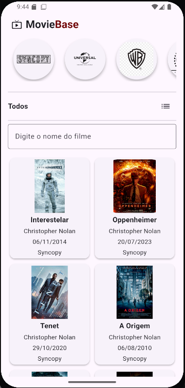
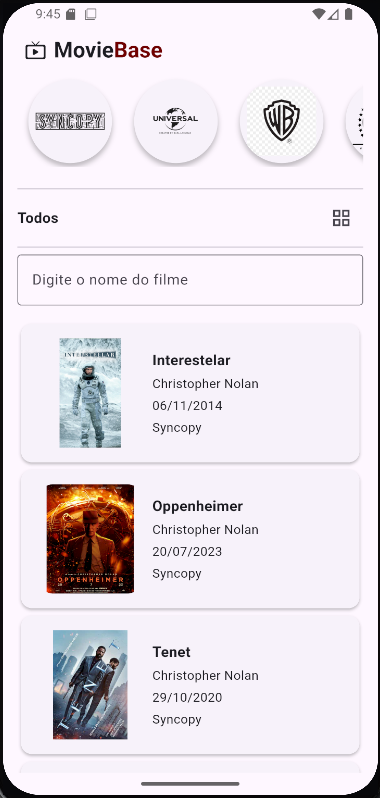
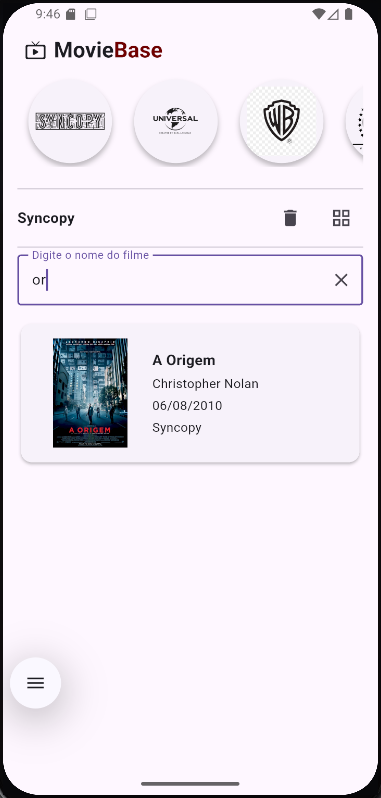

# 🎬 DCP MovieBase
Um catálogo de filmes desenvolvido em Flutter, com foco em gerenciamento de dados e construção de interfaces responsivas multiplataforma.

## 📚 Sobre o Projeto
Este projeto foi desenvolvido como atividade acadêmica na disciplina de Desenvolvimento Cross Plataform, onde a primeira parte foi construída em aula para aprender os conceitos fundamentais de manipulação de listas e exibição de dados. O restante foi implementado como desafio complementar. O projeto utiliza dados mockados nos repositories e foca em estruturas de dados, manipulação e renderização de listas dinâmicas em Flutter.

## 🎯 Objetivo de Aprendizado
O principal objetivo deste projeto foi consolidar conhecimentos sobre:
✅ Estruturas de dados (listas e coleções) em Dart
✅ Manipulação e iteração de dados em Flutter
✅ Filtragem e ordenação de elementos
✅ Desenvolvimento de UI em Flutter com base em listas dinâmicas
✅ Uso de repositories com dados mockados
✅ Renderização eficiente de listas grandes
✅ Boas práticas na organização de dados e componentes

## 🛠️ Tecnologias
- **Linguagem**: Dart
- **Framework**: Flutter
- **Plataformas Suportadas**: iOS, Android, Web, macOS, Windows, Linux
- **Build Tool**: Flutter (pub.dev)
- **Gerenciamento de Estado**: setState / initState (padrão nativo Flutter)

## 📱 Interface do Aplicativo
A seguir estão algumas printscreens do aplicativo em funcionamento:

| Tela Principal | Detalhes do Filme | Busca e Filtros |
|---|---|---|
|  |  |  |

## 🚀 Como Usar

### Pré-requisitos
- Flutter SDK instalado ([Download](https://flutter.dev/docs/get-started/install))
- Dart SDK (incluído no Flutter)
- Um emulador Android/iOS ou dispositivo físico conectado

### Instalação e Execução
1. Clone o repositório:
```bash
git clone https://github.com/Fiszbejn/DCP_MovieBase.git
cd DCP_MovieBase
```

2. Instale as dependências:
```bash
flutter pub get
```

3. Execute o aplicativo:
```bash
# Para Android
flutter run -d android

# Para iOS (macOS apenas)
flutter run -d ios

# Para Web
flutter run -d chrome

# Para Desktop
flutter run -d linux    # ou macos / windows
```

## 📋 Estrutura do Projeto
```
lib/
├── main.dart                 # Ponto de entrada da aplicação
├── model/                    # Modelos de dados
├── repository/               # Dados mockados da aplicação
└── ui/
    ├── components/           # Componentes reutilizáveis
    └── screens/              # Telas da aplicação
```

## 🎥 Funcionalidades Principais
- 📚 **Catálogo Dinâmico**: Listagem completa de filmes com informações detalhadas
- 🔍 **Busca e Filtros**: Filtrar filmes por título e Produtora
- ⭐ **Detalhes do Filme**: Visualizar informações de cada filme
- 💾 **Dados Mockados**: Utiliza repositories com dados pré-definidos

## 📝 Notas
Este é um projeto educacional focado no aprendizado de manipulação de listas, estruturas de dados e exibição de informações em Flutter. O código reflete os conceitos trabalhados em aula e o aprofundamento através dos desafios propostos da disciplina DCP.

## 👤 Autor
Desenvolvido por [Davi Fiszbejn](https://github.com/Fiszbejn)
